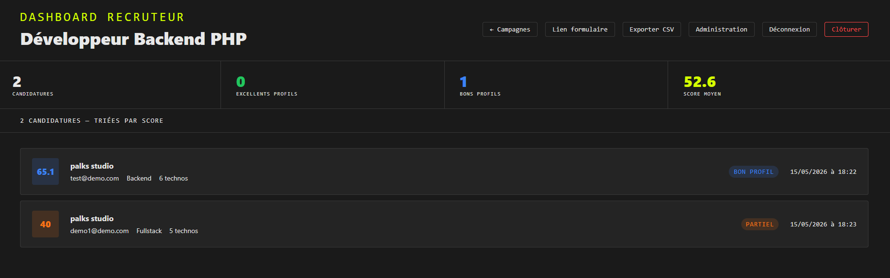

<p align="center">
  
</p>

> 🇫🇷 Français | [🇬🇧 English](./README.md)


[](https://www.youtube.com/@Palks_Studio)
[](https://www.linkedin.com/in/palks-studio/)
[](https://palks-studio.com/fr/recrutement-sans-saas)


<p align="center">
  <a href="https://palks-studio.com">
    
  </a>
</p>

# Palks Studio — Système de recrutement autonome  
**Recrutement structuré avec scoring automatique, gestion des candidatures et déploiement autonome sur serveur**

> Ce dépôt constitue une présentation technique et une documentation du projet.  
> Il ne contient pas de code source téléchargeable ni de fichiers de production.

Ce README documente les principes de conception et l’architecture du système.  
Il évite volontairement toute procédure opérationnelle ou détail sensible.

---

## Présentation

> Système de recrutement par matching automatique — PHP 8.x, sans base de données, sans SaaS.

CANDIDATE_SYSTEM est un moteur de recrutement autonome déployable sur tout hébergement Apache / PHP 8.x standard.

Le candidat remplit un formulaire structuré. Ses réponses sont scorées automatiquement contre un profil de poste défini par le recruteur. Le dashboard affiche les candidatures classées par score de matching — du plus pertinent au moins pertinent.

Aucune base de données. Aucun SaaS. Aucun abonnement. Les données restent sur le serveur du client.

Curieux de découvrir l'application complète ? La playlist de démonstration est disponible ici : [Voir la playlist complète de démonstration](https://www.youtube.com/watch?v=XvAyDijrie0&list=PLeGrXIBUO5xA)

---

## Structure du projet

```
candidate_system/
│
├── public/
│  ├── panel.php                      → Interface administrateur
│  ├── record.php                     → Vue détaillée d'une candidature
│  ├── finalize.php                   → Fermeture et purge de la campagne
│  ├── success.php                    → Page de confirmation post-envoi
│  ├── overview.php                   → Dashboard recruteur (accès restreint)
│  ├── file.php                       → Téléchargement sécurisé des fichiers uploadés
│  ├── extract.php                    → Génération CSV
│  ├── form.php                       → Formulaire de candidature
│  └── process.php                    → Traitement, validation, scoring, sauvegarde
│
└── core/
   ├── settings/
   │   ├── init.php                   → Chemins absolus centralisés
   │   └── profile.php                → Données utilisateur
   │
   ├── presets/
   │   ├── fields.json                → template questions par défaut
   │   └── template.php               → template profil par défaut
   │
   ├── storage/
   │   └── batch_1/
   │        ├── settings/
   │        │   ├── fields.json       → Configuration des questions et scoring
   │        │   └── template.php      → Profil du poste
   │        │
   │        └── records/
   │            ├── entries/          → Candidatures JSON
   │            ├── files/            → CV et documents uploadés
   │            ├── archives/         → (réservé)
   │            ├── logs/             → (réservé)
   │            └── closed.lock       → Verrou de fermeture de campagne
   │
   ├── engine.php                     → Moteur de calcul du score
   ├── notify.php                     → Envoi de l'accusé de réception
   ├── LICENCE.md                     → Conditions d’utilisation et cadre légal
   │
   └── docs/
       ├── GUIDE_UTILISATEUR.md       → Guide utilisateur
       └── README_FR.md               → Documentation technique
```


---

## Fonctionnalités

- Formulaire de candidature multi-sections avec champs conditionnels  
- Scoring automatique multi-critères (poids sections, poids questions, scores par réponse)  
- Malus configurables sur réponses spécifiques  
- Dashboard recruteur protégé par mot de passe  
- Gestion multi-campagnes illimitées — chaque campagne est indépendante  
- Vue détaillée d'une candidature avec scores par section et barres de progression  
- Stack technique avec mise en évidence des compétences matchées  
- Export CSV compatible Excel (UTF-8 BOM, séparateur `;`)  
- Interface d'administration complète sans intervention technique  
- Emails automatiques : accusé de réception et email de clôture  
- Fermeture et réouverture de campagne depuis le dashboard  
- Lien formulaire unique par campagne, copiable en un clic

[](https://palks-studio.com/fr/recrutement-sans-saas)

---

## Prérequis

- PHP 8.x  
- Apache avec `mod_rewrite` activé  
- Accès FTP ou SSH  
- Aucune base de données  
- Aucune dépendance externe (pas de Composer, pas de npm)

---

## Logique de scoring

Le score final est calculé sur trois niveaux imbriqués :

```
contribution = scores[réponse] × (weight / 100) × (global_weight / 100)
```


| Niveau | Paramètre       | Description                              |
|--------|-----------------|------------------------------------------|
| 1      | `global_weight` | Poids de la section dans le score final  |
| 2      | `weight`        | Poids de la question dans sa section     |
| 3      | `scores`        | Score brut attribué à chaque réponse     |

**Répartition par défaut :**

| Section                | Poids global |
|------------------------|--------------|
| Expériences terrain    | 60%          |
| Expériences classiques | 20%          |
| Stack technique        | 15%          |
| Disponibilité          | 5%           |

Les poids sont entièrement reconfigurables depuis l'interface d'administration.

**Niveaux de score :**

| Score | Label       |
|-------|-------------|
| ≥ 80  | Excellent   |
| ≥ 60  | Bon profil  |
| ≥ 40  | Partiel     |
| < 40  | Insuffisant |

---

## Sécurité

- Séparation stricte public / privé — aucun fichier de config accessible via le web  
- Protection CSRF sur le formulaire candidat  
- Headers HTTP de sécurité sur toutes les pages  
- Sanitization complète des entrées utilisateur  
- Validation des uploads : PDF uniquement, 5 Mo maximum  
- Session requise pour toutes les pages d'administration  
- Blocage des doublons par email par campagne  
- `Options -Indexes` activé sur le dossier public

---

## Stockage

Chaque candidature est sauvegardée en JSON :

```json
{
    "id": "20260514_143000_abc123",
    "date": "2026-05-14 14:30:00",
    "poste": "Intitulé du poste",
    "prenom": "Prénom",
    "nom": "Nom",
    "email": "email@candidat.com",
    "score_final": 74.5,
    "score_label": "Bon profil",
    "score_detail": {},
    "reponses": {},
    "trigger_fields": {}
}
```


---

© Palks Studio — voir LICENSE.md  
- https://palks-studio.com
